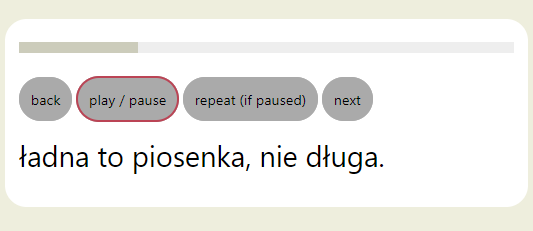

# auvitext

HTML player for mediafiles (audio, video) with synchron text display and easy navigation.

## Media player navigation

A simple player of multimedia content (audio, video) has at least tree buttons: Besides the "play/stop" button there are also the "back" and the "forward" buttons. These last two buttons allow to navigate in the media performance. At every button press the player navigates a couple of seconds backwards or forwards the media performance.

For listeners of podcasts or pop music it would be more user friendly if a press of the back button navigates back to the start of the previous sentence of the text. And a press of the forward button navigates to the start of the next sentence. For listeners of foreign podcasts and learners of a foreign language it would be helpful, if they could read the text or lyrics at the player display, and if they could repeat the actual sentence.

This project allows you to build an audio or video player in HTML and JavaScript, that displays the text, supports navigation to the beginning of text sentences, and allows to repeat sentences. The player has a text display and these four navigation buttons:

* Back
* Play/Stop
* Repeat
* Forward

This is an example:

## Usage

In order to program a HTML mediafile player using the auvitext.js library:

1. Get the text of the mediafile, you want to play, in SRT (SubRip) format.
1. Use the Python script str2auvitext.py of this project. It creates a JavaScript file from the SRT file. This file contains an array of titles, found in the SRT file. Each element of the array has time1, time2 and text. Open this JavaScript file with a text editor and write the name of the media file in the first line.
1. Program an audio (or video) player in HTML, using the HTML audio (or video) tag. Do not specify the name of the mediafile. The tag id of the audio tag (or video tag) must be: avtMedia.
1. Include two JavaScript files in the HTML:
   * the JavaScript file you created from the SRT file
   * auvitext-1.0.js
1. Place four buttons (or dif or span tags) in the HTML, with tis tag id:
   * avtPreviousBtn
   * avtPlayBtn
   * avtRepeatBtn
   * avtNextBtn
1. Place a dif or span tag in the HTML, that serves as the text display. Its tag id must be: avtSubtitle.
1. Place a dif or span tag in the HTML, that serves as a text indicator of the player progress. Its tag id must be: avtProgress. (You can add the "hidden" property, if you perefere not to see this text.)
1. Place the following code in your HTML, that serves as a progress bar. (You can add the "hidden" property to the first div tag, if you perefere not to see the bar.) Be sure to use the same tag id!

		

			

			

		

1. Place this CSS code into yout HTML in order to format the progressbar.

		#avtProgressbarGround { 
			background-color: #eee;
			height: 12px; 
			width: 100%;
		}
		#avtProgressbarProgress { 
			position: relative; 
			top: -12px;
			background-color: #ccb;
			height: 12px; 
		}

So a working media player needs at least four files - see the example in this repository:
* example.m4a
* example.html
* example.js
* auvitext-1.0.js

In order to test this player simply copy these four files onto your computer and doubleclick the example.html. This will start the player in your webbrowser.

## Remarks

1. For audio content do use the M4A audio format instead of the MP3 format because of its much better timing precicion.
1. For navigation you can also use the cursor keys of your PC keyboard.

